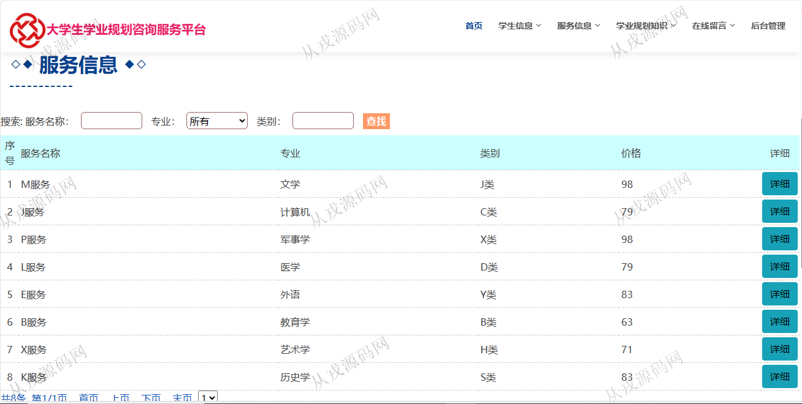
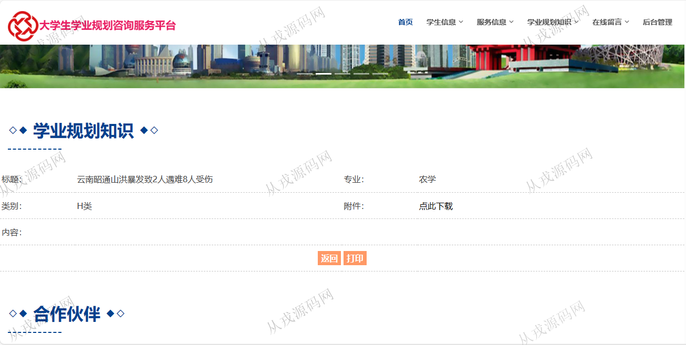
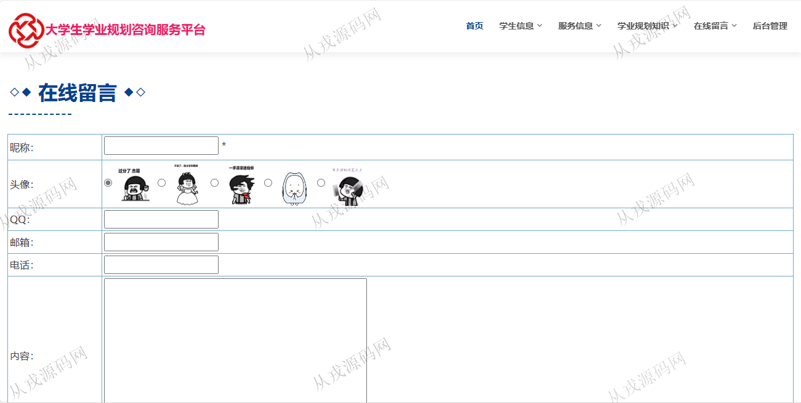
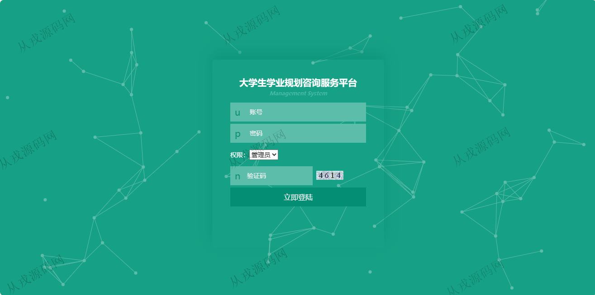
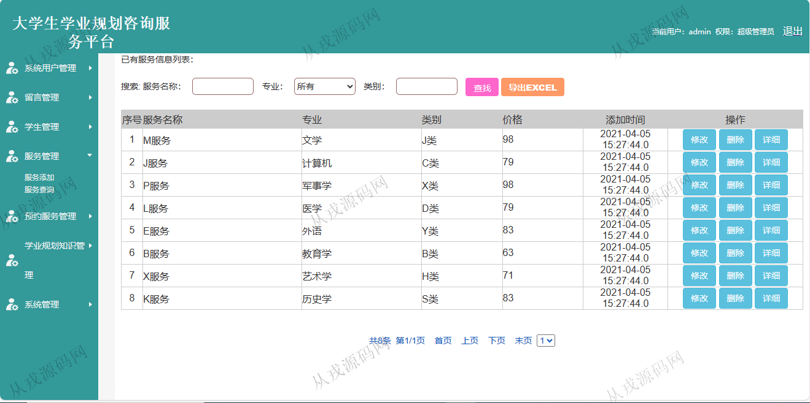
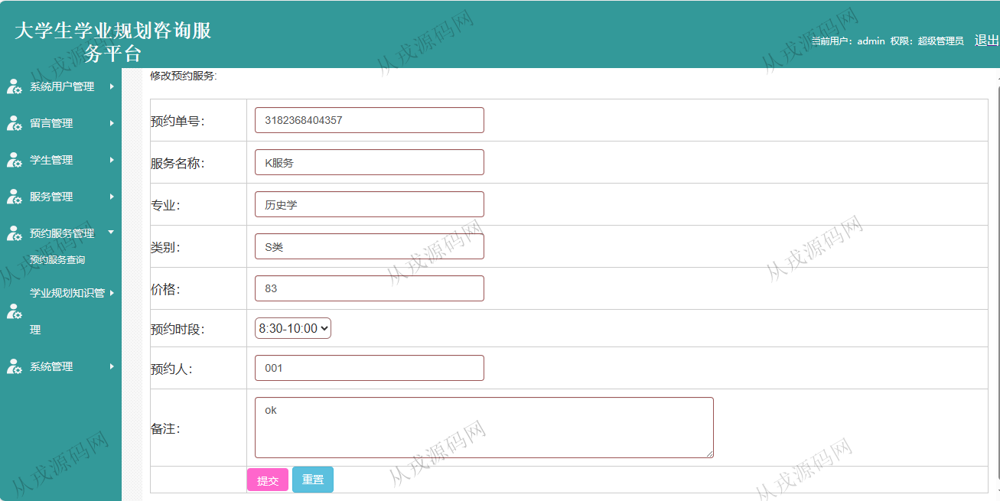

<h1 align="center">84.大学生学业规划咨询服务平台管理系统</h1>

 获取sql文件 QQ: 386869957 QQ群: 377586148 

 [推荐站点: 从戎源码网](https://armycodes.com/) 

## 简介

> 本代码来源于网络,仅供学习参考使用!
>
> 提供1.远程部署/2.修改代码/3.设计文档指导/4.框架代码讲解等服务
>
> 登录地址：http://localhost:8080/userlog.jsp
>
> 学生: 008   密码: 123456
>
> 管理员: admin   密码: 123456
>

## 项目介绍
基于jsp+servlet的大学生学业规划咨询服务平台管理系统：前端 jsp、jquery、ajax，后端 servlet、jdbc，角色分为管理员、学生；集成学生管理、服务管理、预约服务等功能于一体的系统。

## 功能介绍

### 管理员

系统用户管理：管理员信息的新增和删除，密码修改
留言管理：留言信息列表查询，回复和删除
学生管理：学生信息列表查询，修改，删除，查看详情，审核
服务管理：服务信息的增删改查，多条件查询
预约服务管理：预约信息的列表查询，修改，删除，查看详情
学业规划知识管理：学业规划知识的增删改查，多条件查询，附件下载

### 学生

- 基本功能：登录，注册，退出
- 个人资料管理：个人信息查看，修改
- 预约服务管理：预约信息的列表查询，多条件搜索，修改，删除
- 网站首页：主导航栏，轮播图，站内新闻，会员风采
- 服务信息：服务列表查询，服务信息详情，服务预约操作
- 学业规划知识：学业规划知识列表查询，详情查看，附件下载
- 在线留言：留言信息发布

## 环境

- <b>IntelliJ IDEA 2021.3</b>

- <b>Mysql 5.7.26</b>

- <b>Tomcat 7.0.73</b>

- <b>JDK 1.8</b>

## 运行截图

